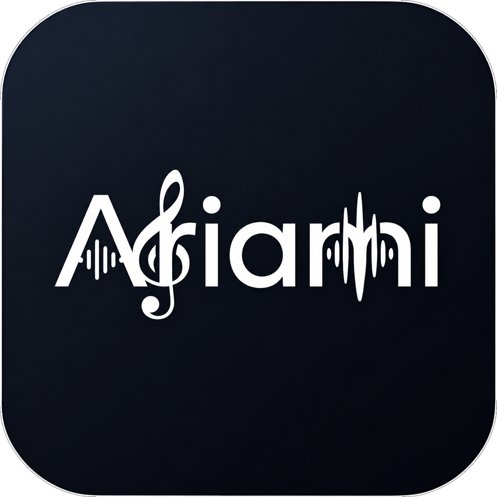

<div align="center">
  
  <h1>Ariami</h1>
</div>

Ariami is a self-hosted music library server with native desktop and mobile players.

---

## Quick Start

1. **Download the desktop server** from [releases](https://github.com/picccassso/Ariami/releases). Pick the ZIP for your OS (for example `Ariami-Desktop-v4.3.0-macos.zip`, `Ariami-Desktop-v4.3.0-windows.zip`, or `Ariami-Desktop-v4.3.0-linux.zip` — filenames follow that pattern for each version).
2. **Download the Android app** from the same [releases](https://github.com/picccassso/Ariami/releases) page (`ariami_apk_release_v4.3.0.apk` for v4.3.0). For iOS, you will have to build it and run it yourself.
3. **Install Tailscale** on the computer running the server and on your phone: [tailscale.com/download](https://tailscale.com/download)
4. **Run the server** and choose your music folder.
5. **Scan the QR code** shown by the server with the mobile app to connect.

### For Raspberry Pi

```bash
# Install Tailscale (follow commands from https://tailscale.com/download/linux/rpi)
curl -fsSL https://tailscale.com/install.sh | sh
sudo tailscale up

# Download and extract Ariami
curl -L https://github.com/picccassso/Ariami/releases/download/v4.3.0/ariami-cli-raspberry-pi-arm64-v4.3.0.zip -o ariami-cli.zip
unzip ariami-cli.zip
cd ariami-cli-raspberry-pi-arm64-v4.3.0

# Run the server
chmod +x ariami_cli
./ariami_cli start

# Web interface opens automatically - scan QR code on phone, complete
```

---

## Why use Ariami?

Ariami is a very easy way to get into self-hosting. You do not need to setup port forwarding or pay for any subscription. It is very easy to setup.
It is cross-platform so you can run this on your Mac/Windows/Linux machine, and is packaged for Raspberry Pis as well. Also works on Android/iOS.

## Features of Ariami:

**Music Library**
- Automatically scans your library and groups albums using embedded tags, so your metadata stays yours and does not depend on flaky external lookups.
- Handles large libraries comfortably.
- Incremental v2 sync: the phone keeps a local copy of the catalog, and the server tracks changes so you are not constantly doing full rescans.
- On mobile, you can use a mixed library view that shows albums and playlists in one place (toggle from the library). Sorting favours what you opened recently on the device, then falls back to the usual ordering.

**Multi-user**
- Password-protected accounts; each user gets their own session, downloads, and playback state.
- One active session per user at a time (signing in on another device replaces the previous session).
- If no one has registered yet, the server runs in open mode so older single-user setups still work.

**Playlists**
- Create and edit playlists in the app, including artwork.
- Folders whose names start with `[PLAYLIST]` become server-side playlists; you can import them to your phone for offline playback.

**Offline and downloads**
- Download music for fully offline playback; imported playlists live on the device.
- Streaming caches tracks you have not downloaded yet, and you can prefer local or cached files even when you are online.
- Server-managed v2 download jobs for big batches, with the download UI tuned for large queues.

**Streaming and audio**
- Stream from the server to any supported client.
- Server-side transcoding powered by Sonic (MP3 -> AAC) so clients can use formats and quality levels that suit the device.
- Quality presets that follow the connection type (for example Wi‑Fi vs mobile data).

**Sonic transcoder (Raspberry Pi 5 benchmarks)**
- Sonic is Ariami's purpose-built transcoder and is much faster than ffmpeg for Ariami's quality-conversion tasks.
- Test setup: Raspberry Pi 5 connected over ethernet, active cooler enabled.
- Average temperature during hard Sonic transcoding: about 68 C (cooler kicked in to dissipate heat).

| Scenario (Pi 5) | Sonic | FFmpeg | Difference |
| --- | --- | --- | --- |
| Original quality (single device, full run) | 57s, 3877.4 MB | 1m 8s, 3877.4 MB | Sonic faster by 11s |
| Medium quality (single device) | 4m 22s, 1993.4 MB (full run) | 53 songs after 2m | Sonic completed full job; FFmpeg was still in progress |
| Low quality (single device) | 4m 36s, 1122.7 MB (full run) | 54 songs after 2m | Sonic completed full job; FFmpeg was still in progress |
| Medium quality, 2 devices at same time | S23: 4m 56s, iPhone 12: 4m 54s (1993.4 MB each) | S23: 41 songs, iPhone 12: 40 songs after 2m | Sonic completed both full jobs |
| Different quality, 2 devices at same time | S23 Low: 8m 12s, iPhone 12 Medium: 7m 55s | S23 Low: 22 songs, iPhone 12 Medium: 28 songs after 2m | Sonic completed both full jobs |

**Apps and platforms**
- Native apps for Android, iOS (build from source), macOS, Windows, and Linux, plus a CLI build with a web dashboard for headless servers.

**Connection, dashboard, and QR**
- No port forwarding: Tailscale gives you a private path to the server over the internet.
- When your phone and server are on the same LAN, the app prefers that path; when you are away it uses Tailscale if it is up, and switches back to LAN when you return.
- The dashboard (desktop app or CLI web UI) shows who is connected, lets admins kick a device or change passwords, and shows whether authentication is required or the server is still open.
- QR setup includes LAN and Tailscale addresses when the server has both, so pairing works at home or on the road.

**Chromecast**
- The mobile app supports casting to Chromecast devices on the same network.

**Listening data**
- On the device, keeps listening stats for songs, albums, and artists, including average daily listening time.
- Richer breakdowns (for example per calendar day) are planned.

**Planned**
- Improve the reliability of Ariami. 

---

## Screenshots

<details>
<summary>Mobile App</summary>

### Appearance View
<p align="center">
  
  
  
  
</p>

### Chromecast View
<p align="center">
  
  
  
</p>

### Connection Stats View
<p align="center">
  
</p>

### Downloads View
<p align="center">
  
  
  
</p>

### Import/Export View
<p align="center">
  
  
</p>

### Library View
<p align="center">
  
  
  
  
</p>

### Main Player View
<p align="center">
  
  
</p>

### Offline View
<p align="center">
  
  
  
</p>

### Playlist View
<p align="center">
  
  
  
  
  
</p>

### Profile Hub
<p align="center">
  
  
  
</p>

### Queue View
<p align="center">
  
  
</p>

### Search View
<p align="center">
  
</p>

### Settings View
<p align="center">
  
  
</p>

### Streaming Quality View
<p align="center">
  
  
</p>

### Streaming Stats View
<p align="center">
  
  
  
</p>

</details>

<details>
<summary>Desktop App</summary>

<p align="center">
  
  
</p>
<p align="center">
  
  
</p>

</details>

<details>
<summary>CLI (Web Interface)</summary>

<p align="center">
  
  
</p>

</details>

---

## Building from Source

If you want to build from source, check the README in each package folder:
- `ariami_desktop/` - Desktop server app
- `ariami_cli/` - CLI server for Raspberry Pi / Linux servers
- `ariami_mobile/` - Mobile client app
- `ariami_core/` - Shared library

**Requirements:** Dart SDK ^3.5.0, and Flutter (latest stable is fine for local builds; GitHub release binaries are built with Flutter 3.29.2).

---

## License

MIT License - See [LICENSE](LICENSE) for details.
