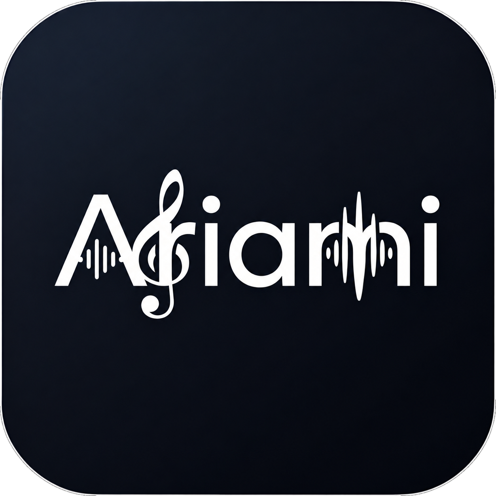

<div align="center">
  
  <h1>Ariami</h1>
  <a href="https://ariami.xyz/">https://ariami.xyz/</a>
</div>


**Ariami is a self-hosted cross-platform music service, aiming to provide an easy experience with getting your music up and running, with clients across mobile, desktop and TV.**

---

## What is Ariami?

Ariami is not a cloud music server, and it only hosts your files. You run the server on your own machine. There are desktop, CLI, and docker server hosts available, with mobile, desktop and TV clients to access your music. The clients are first party, meaning Ariami hands everything end to end. 

When at home, your phone, desktop, TV connects to Ariami over your local network. When you are away from home, [Tailscale](https://tailscale.com/download) gives you a private path to the same server without opening ports on your router.

Ariami's core and mobile client will always be free. The Desktop and TV client requires a one-time purchase to obtain licenses to access them. This helps fund the development and future of Ariami. 

<p align="center">
  
  
  
  
  
</p>
<p align="center"><sub>CLI web dashboard · Desktop server · Desktop client · Mobile player · TV</sub></p>

---

## Download

Get the [latest release](https://github.com/picccassso/Ariami/releases) for your platform:

*Note: Desktop Streaming and TV client must be purchased from Ariami website. They can be purchased separately or as a bundle. A bundle license activates both Desktop and TV clients. 

| Component                 | Platforms             | Notes                                                                                                    |
| ------------------------- | --------------------- | -------------------------------------------------------------------------------------------------------- |
| **Desktop app/server**    | macOS, Windows, Linux | GUI server with setup wizard and dashboard                                                               |
| **CLI / headless server** | Raspberry Pi, Linux   | Background daemon with web setup UI                                                                      |
| **Mobile client**         | Android APK           | Install from releases                                                                                    |
| **Mobile client**         | iOS                   | Build from source (no App Store release yet)                                                             |
| Desktop Client            | macOS, Windows, Linux | Purchased and downloaded from Ariami website.                                                            |
| TV client                 | Android (for now)     | Can be side loaded with .apk files, Amazon App Store + Play Store release coming soon. License required. |

---

## Quick Start

The basic flow is the same everywhere: **download server → choose music folder → create owner account → pair mobile app with QR or invite code → stream music.**

### Desktop app/server (macOS, Windows, Linux)

1. Download and run the desktop app from [releases](https://github.com/picccassso/Ariami/releases).
2. Follow the first-run wizard. Tailscale is optional but recommended for remote access.
3. **Choose your music folder.** The server scans your library from embedded tags.
4. **Create the owner account.** The first account on the server becomes the owner (admin).
5. **Scan the QR code** with the Ariami mobile app, then register or log in.

After setup, the dashboard shows server status, library stats, and the QR code again. **Owner sign-in** is required for admin actions (manage users, kick devices, change passwords).

### Raspberry Pi / CLI server

On first run, the CLI starts in the foreground and opens a **browser setup wizard** (or go to `http://localhost:8080` if it does not open). After setup, `./ariami_cli start` runs as a background daemon.

```bash
# Optional but recommended: install Tailscale
curl -fsSL https://tailscale.com/install.sh | sh
sudo tailscale up

# Download and extract the latest CLI release (example for v4.4.0)
curl -L https://github.com/picccassso/Ariami/releases/download/v4.4.0/ariami-cli-raspberry-pi-arm64-v4.4.0.zip -o ariami-cli.zip
unzip ariami-cli.zip
cd ariami-cli-raspberry-pi-arm64-v4.4.0

chmod +x ariami_cli
./ariami_cli start
```

In the browser wizard:

1. Optional: set up **Tailscale** (or continue with local-only access).
2. **Select your music folder** and wait for the scan.
3. **Create the owner account** and sign in as owner.
4. **Scan the QR code** with the mobile app and register or log in.

Day-to-day: `./ariami_cli start` | `./ariami_cli status` | `./ariami_cli stop`

See `ariami_cli/SETUP.txt` in the release zip for more detail.

### Mobile app

1. Install the **Android APK** from [releases](https://github.com/picccassso/Ariami/releases), or **build iOS from source** (see [Building from Source](#building-from-source)).
2. Optional: install **Tailscale** on your phone for remote access.
3. Scan the **QR code** shown by the server (desktop connection screen or CLI web UI).
4. **Register** a new account or **log in**.

After the owner account exists, new registrations require the time-limited token in the owner's QR code, or a one-time **invite code** from the server dashboard. If you cannot scan the QR, use **Manual entry** in the app, type the server address, and enter the invite code.

---

## Remote access with Tailscale

Ariami works on your LAN out of the box. You do not need port forwarding for home use.

For listening away from home, install [Tailscale](https://tailscale.com/download) on the server and your phone/desktop. Tailscale creates a private network between your devices. The mobile app prefers LAN when you are home and switches to Tailscale when you are away.

Without Tailscale, remote access would require manual port forwarding on your router. Tailscale is optional, but it is the recommended way to reach your server from outside your home network.

---

## Server management

### Owner account

The **first account created becomes the owner/admin.** The owner is created on the server during setup, not from the phone. Use **owner sign-in** on the desktop or CLI web dashboard for admin actions: view connected devices, kick a client, change passwords, delete users, and generate a fresh registration QR or invite code for new phone accounts.

After setup, new registrations require an owner-generated QR code or invite code.

### Dashboard

- **Desktop:** in-app dashboard after setup (Server tab, library stats, connected clients).
- **CLI:** web UI at `http://localhost:8080` (or the next free port 8081–8099).

Both show server status, library stats, connected clients, and registered users. Admin views include live download queues and transcoding activity.

### QR code and invite codes

The server QR code includes LAN and Tailscale addresses when both are available, so pairing works at home or on the road. Registration tokens and invite codes expire after 10 minutes and are single-use.

### Start on boot / autostart

- **Desktop:** Dashboard → **Server** tab → **Start at Login** (launch automatically when you sign in).
- **CLI:** `./ariami_cli autostart enable` (use `disable` or `status` to manage). First-run setup also asks this as a y/N prompt.

### Reset / factory reset

**Ariami never deletes your music folder.** Setup reset clears setup/pairing state; factory reset clears Ariami-owned data such as accounts, sessions, stats, playlists, database, and cache.

- **Desktop:** Dashboard → **Server** tab → **Danger Zone** → Reset Ariami
  - *Setup only:* clears setup progress and pairing state; keeps catalog DB, accounts, and caches.
  - *Factory reset:* clears database, users, sessions, stats, playlists, and cache.
- **CLI:** `./ariami_cli reset` (interactive menu), or `./ariami_cli reset --setup -y` / `./ariami_cli reset --factory -y`

Both reset types require typing `RESET` to confirm. Factory reset also disables Start at Login / autostart.

---

## Why Ariami?

Self-hosting your music usually means wrestling with port forwarding, reverse proxies, and server config. Ariami packages the server, handles library scanning and transcoding, and pairs your phone with a QR code. Run it on the computer you already have, or on a Raspberry Pi in the corner. Your metadata stays in your files, your library stays on your hardware, and there is nothing to pay monthly.

There are plenty of other services that exist out there, and they each excel at something different. What I try to do with Ariami is to make it as easy as possible to use without needing things like port forwarding or reverse proxies or major server configs. Ariami handles everything end to end, with polished clients specifically made for Ariami in order to provide a seamless experience. Ariami server can be run on your Pi, on the computer you already have, and then you can connect your desktop client, your TV client and mobile client, and play across them seamlessly using Ariami Connect. The metadata stays in your files, your library stays on your hardware, and there is nothing to pay monthly. The Desktop and TV clients are a one-time purchase. 

---

## Features

### Library and metadata

- Scans your library and groups albums from embedded tags, so metadata stays yours without flaky external lookups.
- Supports MP3, M4A, MP4, FLAC, WAV, AIFF, OGG, Opus, WMA, AAC, and ALAC.
- Handles large libraries, including Various Artists compilations when appropriate.
- Real-time folder watching: new, changed, or removed files update the library without a full rescan; connected clients get push updates over WebSocket.
- Metadata cache speeds up rescans by skipping unchanged files.
- Incremental v2 sync: the phone keeps a local catalog copy; the server tracks changes so you are not constantly doing full rescans.
- Robust tag reading with sensible fallbacks (including cleaning up mangled characters and YouTube-style channel names) so albums group correctly.
- Server-side artwork is resized and cached for efficient delivery.
- On mobile: grid, list, or mixed views; pin albums and playlists (pins sync across your devices); filter to downloaded content; multi-select batch downloads; search with recent history (works offline against downloads).
- Fast, forgiving search shared across every client, with transliteration and keyboard-layout correction so a mistyped or differently-scripted query still finds the right track.

### Mobile player

- Background playback with lock screen and notification controls.
- Mini player and full-screen player with a swipeable artwork carousel, seek bar, shuffle, repeat (off/all/one), and resume where you left off.
- Optional gapless playback that preloads the next track so albums flow without silence.
- Graphic equalizer with built-in and custom presets and a live frequency-response curve (native audio processing on iOS, platform EQ on Android).
- Auto-pause when you turn the system volume all the way down, and resume when you turn it back up.
- Dynamic player colours from album artwork; appearance settings including light, dark, system, preset colours, a custom colour picker, and a lock-to-a-chosen-cover mode.
- A responsive layout that expands into a sidebar with a docked now-playing card on tablets and in landscape.
- Profile hub with optional local avatar and a quick listening snapshot.

### Downloads and offline

- Download music for fully offline playback.
- Manual offline mode to disconnect on purpose and keep using downloads.
- When the connection drops, the app stays usable offline and reconnects when the network returns.
- Streaming cache for tracks you have not downloaded yet; prefer local or cached files even when online.
- Downloads screen for in-progress, failed, and completed downloads, grouped by album with recovery for interrupted downloads; bulk download options; original-quality "fast" downloads that bypass transcoding when appropriate.
- On Android, big downloads keep going in the background after you leave the app.
- Optional "cooler downloads" mode that paces large batches to cut heat and battery drain.
- Cache controls for streaming artwork and tracks, including size limits and clear cache.
- Server-managed download jobs for big batches, with throttling and per-user concurrency limits so one device never starves the others.

### Queue and playback

- View, reorder, and clear the queue; play next or add to queue from menus; swipe list rows to queue.
- HTTP range requests for seeking while streaming.
- Quality presets that follow connection type (Wi‑Fi vs mobile data), with separate settings for streaming and downloads.
- Server-side transcoding powered by Sonic (MP3 → AAC) so clients can use formats and quality levels that suit the device.

### Ariami Connect

- Play across all of your signed-in devices, Spotify-Connect style. Start a song on your phone and push it to your desktop or TV, or take over playback from another device.
- The controlling device mirrors the active player's queue and transport, and its own controls become remote commands: play/pause, next/previous, seek, volume, shuffle, and repeat.
- Edit the active device's queue remotely — reorder, add, remove, or clear upcoming tracks.
- Automatic handoff if the active player drops out, and every device can be renamed so it is easy to pick from the list.
- Works across LAN and Tailscale, so devices at home and away can play together.

### Playlists

- Create and edit playlists in the app, including custom cover art, reordering, and renaming. Cover photos sync across your devices.
- Like songs from the player to build a Liked Songs playlist.
- Folders whose names start with `[PLAYLIST]`, and `.m3u` playlist files, become server-side playlists. The server can also suggest playlist folders it detects and let the owner approve them.
- Import server playlists to your devices as editable copies; your edits (add, remove, reorder, rename) sync back to the server and to your other clients, and queue up to replay if you make them offline.
- "Clean up" a playlist to remove ghost entries — songs that were deleted from the server and that you have not downloaded.

### Multi-user and auth

- Password-protected accounts (minimum 10 characters); each user gets their own session, downloads, playback state, and listening stats.
- The first account created becomes the owner/admin. After setup, new registrations require an owner-generated QR code or invite code (both single-use and time-limited). Headless CLI setups can bootstrap the owner with a one-time code printed to the console.
- Your account can be signed in on multiple devices at the same time — phone, desktop, and TV can all stay connected and play together through Ariami Connect. Signing in again on the *same* device replaces only that device's session.
- Login rate limiting helps protect against brute-force attempts (repeated failures trigger a short cooldown).
- Optional account picker on TV sign-in is off by default, so a server never lists its account names unless the owner turns it on.

### Desktop and CLI server

- **Desktop:** GUI server with system tray (minimize to tray instead of quitting), first-run wizard, admin dashboard, Start at Login, and reset options.
- **CLI:** headless server for Raspberry Pi and Linux with `start`, `stop`, `status`, `autostart`, and `reset` commands, a background daemon after setup, optional custom port, and a web UI for setup and administration.

### Desktop Client

The paid desktop player (macOS, Windows, Linux) connects to your Ariami server and turns any computer into a full Ariami player. Purchased and downloaded from the Ariami website.

- A three-column player (library, content, now-playing panel) with a queue, shuffle, repeat, seek, volume, gapless playback, and a 5-band equalizer with presets.
- Connects to a server over LAN or Tailscale with a one-time invite code, stays signed in securely, and reconnects on its own — dropping to your downloads if the server goes away.
- Full downloads and offline mode: download tracks, albums, playlists, or your whole library to a visible folder, keep playing offline, and optionally prefer local copies while online to save bandwidth.
- Streaming quality presets (High/Medium/Low), playlists with Liked Songs, fast search, and account-wide listening stats with Spotify history import.
- Ariami Connect to play across your other devices; light, dark, preset, custom, and cover-art theming; interface zoom; OS media-key and Now Playing integration; and built-in updates.

### TV client

Ariami TV (Android TV and Fire TV) is a big-screen player that connects to your server over your local network. Requires a license; side-load the APK today, with Amazon Appstore and Play Store releases on the way.

- Finds your server automatically on the local network, or enter its address manually. Sign in once and it stays paired, reconnecting on its own if the server's address changes. TV is LAN-only by design (no Tailscale/remote).
- D-pad-first library: browse albums, playlists, and pinned items with detail screens, and playlist edits made elsewhere show up here.
- Full-screen now-playing with artwork, a seek bar, an upcoming-queue view, shuffle, repeat (off/all/one), and resume after the TV is switched off — plus a "screen off" mode that keeps playing with the display dark.
- Ariami Connect: control the TV from your phone or desktop, or use the TV to control another device.
- Shared search, and dark, light, preset, custom, and cover-art theming.
- Playback-focused — editing, pinning, and downloads live on your phone or desktop.

### Chromecast

- Cast from the mobile app to Chromecast devices on the same network.

### Listening stats

- Account-wide listening stats that follow you across every Ariami device: what you play on your phone, desktop, or TV all rolls into one history, kept in sync through the server.
- Tabbed top tracks, artists, and albums, with play counts and time listened.
- Time-range views: all-time, today, or a specific day, week, month, or year, with a date picker and stepping controls.
- Featured artists get credited individually, so a guest verse counts toward that artist too.
- Average daily listening time and a quick profile snapshot (total playtime, songs played, top artist and song).
- Import your **Spotify** listening history and match it against your library, so your stats come with you. Export and import your playlists and stats as JSON for backup or moving to a new device.

### Sonic transcoding

- Sonic is purpose-built for Ariami's music transcoding workload (MP3 → AAC). In Ariami's own Raspberry Pi 5 tests, Sonic completed full transcoding jobs faster than FFmpeg for the same scenarios. Sonic is not a general FFmpeg replacement; FFmpeg is still used for artwork processing.

<details>
<summary>Sonic transcoder benchmarks (Raspberry Pi 5)</summary>

Test setup: Raspberry Pi 5 connected over ethernet, active cooler enabled. Average temperature during hard Sonic transcoding: about 68 C (cooler kicked in to dissipate heat).

| Scenario (Pi 5) | Sonic | FFmpeg | Difference |
| --- | --- | --- | --- |
| Original quality (single device, full run) | 57s, 3877.4 MB | 1m 8s, 3877.4 MB | Sonic faster by 11s |
| Medium quality (single device) | 4m 22s, 1993.4 MB (full run) | 53 songs after 2m | Sonic completed full job; FFmpeg was still in progress |
| Low quality (single device) | 4m 36s, 1122.7 MB (full run) | 54 songs after 2m | Sonic completed full job; FFmpeg was still in progress |
| Medium quality, 2 devices at same time | S23: 4m 56s, iPhone 12: 4m 54s (1993.4 MB each) | S23: 41 songs, iPhone 12: 40 songs after 2m | Sonic completed both full jobs |
| Different quality, 2 devices at same time | S23 Low: 8m 12s, iPhone 12 Medium: 7m 55s | S23 Low: 22 songs, iPhone 12 Medium: 28 songs after 2m | Sonic completed both full jobs |

</details>

### Planned

- Even richer listening-stats views and history breakdowns.
- Extension and integration support.

---
## Roadmap 

Where does Ariami go from here? 

I have a lot planned for Ariami, as I believe this is just the beginning with this piece of software. Some of the things planned:

- Role-based access control for families. This means families can choose what music certain users can listen to, with explicit song/album filtering. 
- Better individual user control. Right now, one library is accessed by everyone, however, there is currently no ability to hide/manage songs/albums/playlists per person.
- More stats imports. Spotify history import already ships, so your Spotify listening comes with you. YouTube Music and Apple Music are next — I do not use both services, so I do not yet have a valid set of listening stats to pull from them. Once I do, I will implement it into Ariami so your stats come with you from those services as well. 
- If there is demand for it, Ariami for tvOS (Apple TV) is something I am willing to look into. 
- These are just some of the things - however, the most important: user feedback that helps improve the service. I have done everything in my power to test on as many VMs, laptops/PCs, TVs as I can get my hands on, however, that is still relatively small to the breadth of devices that are out there. The more issues that are reported to me, the more I can work with to make this service as good as possible. 

**Ariami 6.0** 

- Ariami 6.0 is quite far away. But, one of the main things I would like for Ariami 6.0 is the ability for user sessions on TV where anybody can join a TV session, control, manage it, etc. This will be a very very difficult task to do, hence why it's so far away.

---

## Screenshots

Tap a section to expand. All images reflect the current app UI.

<details>
<summary><strong>CLI Web Dashboard</strong> (4 screenshots)</summary>

<br>

<p align="center">
  
  
</p>
<p align="center">
  
  
</p>

</details>

<details>
<summary><strong>Desktop App (server)</strong> (6 screenshots)</summary>

<br>

<p align="center">
  
  
</p>
<p align="center">
  
  
</p>
<p align="center">
  
  
</p>

</details>

<details>
<summary><strong>Desktop App (server + client)</strong> (15 screenshots)</summary>

<br>

#### Home and library

<p align="center">
  
  
</p>
<p align="center">
  
  
</p>

#### Playlists and recently played

<p align="center">
  
  
</p>
<p align="center">
  
  
</p>
<p align="center">
  
</p>

#### Settings

<p align="center">
  
  
</p>
<p align="center">
  
  
</p>
<p align="center">
  
  
</p>

</details>

<details>
<summary><strong>Mobile App</strong> (27 screenshots)</summary>

<br>

#### Library and browse

<p align="center">
  
  
</p>

#### Player and Ariami Connect

<p align="center">
  
  
  
  
</p>
<p align="center">
  
</p>

#### Playlists

<p align="center">
  
  
  
  
</p>
<p align="center">
  
</p>

#### Downloads and import/export

<p align="center">
  
  
  
</p>

#### Settings, connection, and sound

<p align="center">
  
  
  
  
</p>
<p align="center">
  
  
</p>

#### Profile and stats

<p align="center">
  
  
  
  
</p>
<p align="center">
  
  
</p>

</details>

<details>
<summary><strong>TV App</strong> (11 screenshots)</summary>

<br>

#### Home and browse

<p align="center">
  
  
</p>
<p align="center">
  
  
</p>

#### Now playing and Ariami Connect

<p align="center">
  
  
</p>
<p align="center">
  
  
</p>
<p align="center">
  
</p>

#### Settings

<p align="center">
  
  
</p>

</details>

---

## Building from Source

If you want to build from source, check the README in each package folder:

- `ariami_desktop/` - Desktop app/server
- `ariami_cli/` - CLI server for Raspberry Pi / Linux servers
- `ariami_mobile/` - Mobile client app
- `ariami_core/` - Shared library

**Requirements:** Dart SDK ^3.5.0, and Flutter (latest stable is fine for local builds; GitHub release binaries are built with Flutter 3.44.0).

**iOS:** there is no App Store release yet. Build and install on your own device with `flutter build ios` (requires macOS and Xcode).

Clone with submodules if you need the Sonic transcoder for desktop builds:

```bash
git clone --recurse-submodules https://github.com/picccassso/Ariami.git
```

---

## License

MIT License - See [LICENSE](LICENSE) for details.