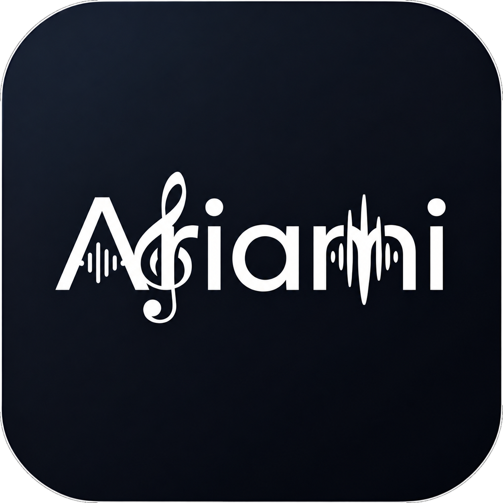

<div align="center">
  
  <h1>Ariami</h1>
  <p><strong>Your music. Your server. One playback session across your devices.</strong></p>
  <p>
    <a href="https://apps.apple.com/us/app/ariami/id6789298823"></a>
    <a href="https://www.amazon.com/gp/mas/dl/android?asin=B0GZFT53WL"></a>
  </p>
  <p>
    <a href="https://ariami.xyz/">Website</a> ·
    <a href="https://github.com/picccassso/Ariami/releases">Downloads</a> ·
    <a href="#get-the-apps">Get the apps</a> ·
    <a href="#quick-start">Quick Start</a> ·
    <a href="#documentation">Docs</a> ·
    <a href="docs/connect/README.md">Ariami Connect</a>
  </p>
</div>

---

## What Ariami is

Ariami turns a folder of music files on your computer into a personal streaming service for
your household. Point the server at the audio files you already own, and it reads their tags to
build your library. From there, you can stream or download your music using the mobile, tablet,
desktop, and TV apps, either at home over Wi-Fi or away from home with
[Tailscale](https://tailscale.com/download).

Everything runs on your own machine, including user accounts, playlists, and listening history,
and you don't need to set up port forwarding or a reverse proxy to use it.

```
   your music folder  ─→  Ariami server  ─→  Mobile · Desktop Player · TV
   (MP3, FLAC, M4A…)      (scan, stream,      (stream, download,
                           transcode, sync)     play offline)

                     Desktop Server · CLI / Raspberry Pi · Docker
                              pick one to host
```

The server and the apps are built together around their own protocol, which is how features
like Ariami Connect work across all of them. If you want to build a third-party client or see
how it works under the hood, the **Ariami Connect protocol is documented** in
[`docs/connect/`](docs/connect/README.md), including a
[third-party client guide](docs/connect/06-third-party-clients.md).

---

## Get the apps

Ariami is available on the app stores. Both downloads are free, though the TV app needs a
licence key from [ariami.xyz](https://ariami.xyz/) to unlock.

| Store | App | |
| --- | --- | --- |
| **Apple App Store** | Ariami for iPhone and iPad (free) | [Download →](https://apps.apple.com/us/app/ariami/id6789298823) |
| **Amazon Appstore** | Ariami TV for Fire TV (free download, unlocked with a licence) | [Get it →](https://www.amazon.com/gp/mas/dl/android?asin=B0GZFT53WL) |

For Android phones and Android TV, you can grab the APKs from
[releases](https://github.com/picccassso/Ariami/releases) while the Play Store release is in
progress. The Desktop Player can be bought and downloaded at [ariami.xyz](https://ariami.xyz/),
and all the servers (Desktop Server, CLI, Docker) are free on the
[releases](https://github.com/picccassso/Ariami/releases) page.

You'll need to set up a server on your computer first so the apps have something to connect to.
See [Quick Start](#quick-start) below.

---

## Ariami Connect

**Connect lets you hand off playback, your queue, and your current track position between any
of your signed-in devices.** Start an album on your phone, send it to the TV, and control it
from your desktop.

- Send playback to another signed-in device, or pull it over to the one you're using.
- When controlling another device, your app mirrors its queue and playback state. Play/pause,
  skip, seek, volume, shuffle, and repeat act as remote controls.
- Edit the active player's queue remotely (reorder, add, remove, or clear tracks).
- If the active player disconnects, playback hands off automatically. You can also rename any
  of your devices.
- Works over LAN and Tailscale together, so a TV on your home network and a phone on mobile
  data still share the same session.

Whichever device is playing streams audio directly from the server, while your other devices
just send playback and queue commands through the server. See
[`docs/connect/01-architecture.md`](docs/connect/01-architecture.md) for how it works.

---

## Screenshots

<p align="center">     </p>
<p align="center"><sub>CLI web dashboard · Desktop Server · Desktop Player · Mobile · Tablet · TV</sub></p>

<details>
<summary><strong>CLI web dashboard</strong> (5 screenshots)</summary>

<p align="center"> </p>
<p align="center"> </p>
<p align="center"></p>

</details>
<details>
<summary><strong>Desktop Server</strong> (6 screenshots of the admin dashboard)</summary>

<p align="center"> </p>
<p align="center"> </p>
<p align="center"> </p>

</details>
<details>
<summary><strong>Desktop Player</strong> (23 screenshots, shown running alongside a server)</summary>

#### Home and albums

<p align="center"> </p>
<p align="center"> </p>

#### Full-screen player and music visualizer

<p align="center"> </p>
<p align="center"> </p>

#### Playlists, recently played, and discovery

<p align="center"> </p>
<p align="center"> </p>
<p align="center"> </p>
<p align="center"></p>

#### Settings

<p align="center"> </p>
<p align="center"> </p>
<p align="center"> </p>
<p align="center"> </p>

</details>
<details>
<summary><strong>Mobile</strong> (27 screenshots)</summary>

#### Library, albums, and search

<p align="center">   </p>
<p align="center"></p>

#### Player and Ariami Connect

<p align="center">   </p>
<p align="center"></p>

#### Playlists

<p align="center">   </p>

#### Settings, playback, and downloads

<p align="center">   </p>
<p align="center">  </p>

#### Profile, stats, and discovery

<p align="center">   </p>
<p align="center"> </p>

</details>
<details>
<summary><strong>Tablet layout</strong> (9 screenshots, same app with sidebar and docked player)</summary>

The mobile app expands into a tablet layout with a sidebar and a docked now-playing card, on
both iPad and Android tablets.

#### Library and search

<p align="center"> </p>
<p align="center"></p>

#### Albums and player

<p align="center"> </p>
<p align="center"></p>

#### Settings and download quality

<p align="center"> </p>
<p align="center"></p>

</details>
<details>
<summary><strong>TV</strong> (8 screenshots)</summary>

#### Home and browse

<p align="center"> </p>
<p align="center"> </p>
<p align="center"></p>

#### Now playing and Ariami Connect

<p align="center"> </p>

#### Settings

<p align="center"></p>

</details>

---

## Step 1: Choose a server

The server points at your music folder, scans it, and streams to your devices. Pick whichever
setup fits your hardware. You only need one.

| Server | Runs on | Best for |
| --- | --- | --- |
| **Desktop Server** | macOS, Windows, Linux | Running on the computer where your music already lives. Has a first-run wizard, admin dashboard, system tray icon, and start-at-login. |
| **CLI server** | Raspberry Pi, Linux, macOS, Windows | An always-on machine tucked away somewhere. Runs headless with a browser setup wizard and web dashboard. |
| **Docker** | Anywhere Docker runs | NAS and homelab setups. Image: `ghcr.io/picccassso/ariami-cli` (see [DOCKER.md](ariami_cli/docker/DOCKER.md)). |

All three are free, run the same server core, and have the same admin features.
[Download the latest release →](https://github.com/picccassso/Ariami/releases)

## Step 2: Choose your playback apps

| App | Platforms | Availability |
| --- | --- | --- |
| **Mobile** | Android, iOS (phones and tablets) | Free. iOS/iPadOS is on the [App Store](https://apps.apple.com/us/app/ariami/id6789298823). Android APK is in [releases](https://github.com/picccassso/Ariami/releases) (Play Store release in progress). |
| **Desktop Player** | macOS, Windows, Linux | One-time purchase from [ariami.xyz](https://ariami.xyz/). Standalone desktop player, separate from the Desktop Server above. |
| **TV** | Fire TV, Android TV | One-time licence from [ariami.xyz](https://ariami.xyz/). Free download on the [Amazon Appstore](https://www.amazon.com/gp/mas/dl/android?asin=B0GZFT53WL) for Fire TV. For Android TV, sideload the APK from [releases](https://github.com/picccassso/Ariami/releases) (Play Store release in progress). Works over LAN only by design. |

You can run the Desktop Server and the Desktop Player on the same computer if you want, or use
either one on its own.

---

## Quick Start

1. **Install a server.** Grab the Desktop Server or CLI build for your OS from
   [releases](https://github.com/picccassso/Ariami/releases), or pull the Docker image. On first
   run, the CLI opens a setup wizard in your browser (go to `http://localhost:8080` if it
   doesn't open automatically).
2. **Pick your music folder.** Ariami reads the tags in your files to build your library and
   leaves the files themselves untouched.
3. **Create the owner account.** The first account you create on the server becomes the
   owner/admin account.
4. **Pair a device.** Scan the QR code from the server dashboard, or type in the server address
   and invite code. See the [mobile setup guide](ariami_mobile/docs/SETUP.md) for details on
   invite expiry and accounts.
5. **Start listening.** Sign in with the same account on your other devices and use Ariami
   Connect to switch playback between them.

Out of the box, Ariami works over your local home network. If you also want to listen away from
home, install [Tailscale](https://tailscale.com/download) on the server and your devices. The
apps will use your local network when you're home and switch over to Tailscale when you leave.

Common CLI commands: `./ariami_cli start` · `status` · `stop` · `autostart enable` ·
`reset`. Full list in the [CLI reference](ariami_cli/docs/CLI_REFERENCE.md).

---

## Core capabilities

<details>
<summary><strong>Library and search</strong></summary>

Scans MP3, M4A, MP4, FLAC, WAV, AIFF, OGG, Opus, WMA, AAC, and ALAC files. Albums (including
Various Artists compilations) are grouped using your existing file tags without reaching out to
external metadata services.

The server watches your music folder in real time, so newly added, edited, or removed files show
up on connected clients right away without needing a full rescan. Unchanged files are skipped
via a metadata cache, and clients keep a local copy of the catalogue so they only need to sync
changes. Search works the same across all apps and handles transliteration and wrong keyboard
layouts, so typos or different scripts still find what you're looking for.

Details: [core docs](ariami_core/docs/README.md) ·
[playlist detection](ariami_core/PLAYLIST_DETECTION.md)

</details>
<details>
<summary><strong>Playback, downloads and offline</strong></summary>

Supports background playback with OS and lock-screen media controls, gapless playback, queue
editing, shuffle, repeat, and an equalizer with built-in and custom presets. If you replace
your queue by accident, there's an undo button, and you can choose whether "Play next" tracks
stack in the order you tapped them.

You can download individual tracks, albums, playlists, or your entire library for offline use
at Original, High, Medium, or Low quality. Apps fall back to offline mode automatically if you
lose connection (or you can toggle it manually). Streaming and download quality can be configured
separately based on whether you're on Wi-Fi or mobile data, and streamed tracks are cached along
the way.

On the server, transcoding is handled by Sonic (MP3/WAV/FLAC → Opus/AAC/M4A/MP3) with per-user
concurrency limits so one big download job doesn't slow down everyone else. Both the Mobile app
and Desktop Player can cast to Chromecast, and you can control a Desktop cast from your phone
over Ariami Connect.

Details: [mobile features](ariami_mobile/docs/FEATURES.md) ·
[desktop features](ariami_desktop/docs/FEATURES.md)

</details>
<details>
<summary><strong>Playlists</strong></summary>

Create and edit playlists in the apps, set custom cover art that syncs across your devices,
reorder tracks, and save favourites to Liked Songs.

On the server side, folders named `[PLAYLIST]...` and `.m3u` files are picked up as playlists,
and any newly detected playlist folders can be reviewed and approved by the server owner. Server
playlists can be imported to your devices as editable copies, and any changes you make offline
sync back once you're reconnected.

</details>
<details>
<summary><strong>Custom tags and smart filtering</strong></summary>

If you run your own tools over your music, such as [Essentia](https://essentia.upf.edu/) for
genre and mood analysis, you can send the results to your server as tags on each track. A tag
can be a true/false flag, a number, or a list of words, and you can point at a track by its path
in your music folder.

Then ask the server for the songs that match, like "every instrumental track tagged ambient
that's not already in my Focus playlist", sorted by BPM. Save the results as a playlist and it
shows up in every Ariami app.

Tags are shared by every account on the server and stay put through rescans. You work with them
through the HTTP API, so they suit scripts and companion tools.

Details: [custom song tags guide](ariami_core/docs/SONG_ATTRIBUTES.md)

</details>
<details>
<summary><strong>Accounts and multi-device</strong></summary>

Each user gets a password-protected account (10 characters minimum) with their own sessions,
downloads, playback state, and listening stats. The first account registered is the owner/admin.
After that, new users need a single-use, time-limited QR code or invite code generated by the
owner (headless servers can also bootstrap the owner account with a one-time console code).

You can stay signed in to the same account on your phone, desktop, and TV at the same time,
which is how Ariami Connect links them together. Login attempts are rate-limited, and the TV
account picker is turned off by default so the server doesn't expose usernames on the login
screen unless the owner enables it.

</details>
<details>
<summary><strong>Listening stats</strong></summary>

Listening stats are tracked per account, so plays from your phone, desktop, and TV all count
toward the same history. You can view top tracks, artists, and albums by play count or time
listened, filtered by day, week, month, year, or all-time. Featured artists are credited
individually, and you get daily listening averages along with a profile summary.

If you're moving over from Spotify, you can import your Spotify listening history and match it
against your local library. Playlists and stats can also be exported as JSON.

Details: [listening stats](ariami_core/docs/LISTENING_STATS.md)

</details>
<details>
<summary><strong>Server administration</strong></summary>

Both the Desktop Server app and the CLI's web dashboard show server status, library size,
connected clients, registered users, active download queues, and live transcoding jobs.

From the dashboard, the server owner can add or remove users, reset passwords, kick devices,
create pairing QR/invite codes, trigger library rescans, run Spotify imports, and start, stop,
or restart the CLI server. You can also set custom endpoint aliases, mask IPs in the UI, and
turn on start-at-login.

**Ariami never deletes files from your music folder.** A setup reset only clears pairing and
setup state, while a factory reset wipes Ariami's own database, accounts, stats, playlists, and
cache (both require typing `RESET` to confirm).

Details: [RESET.md](RESET.md) · [CLI configuration](ariami_cli/docs/CONFIGURATION.md)

</details>
<details>
<summary><strong>Sonic transcoder benchmarks (Raspberry Pi 5)</strong></summary>

Sonic was built specifically for Ariami's audio transcoding (MP3/WAV/FLAC → Opus/AAC/M4A/MP3).
FFmpeg is still used separately for resizing album art.

Test setup: Raspberry Pi 5 over Ethernet with the active cooler on. Average temperature during
heavy Sonic transcoding was around 68 °C.

| Scenario (Pi 5) | Sonic | FFmpeg | Difference |
| --- | --- | --- | --- |
| Original quality (single device, full run) | 57s, 3877.4 MB | 1m 8s, 3877.4 MB | Sonic faster by 11s |
| Medium quality (single device) | 4m 22s, 1993.4 MB (full run) | 53 songs after 2m | Sonic completed full job; FFmpeg was still in progress |
| Low quality (single device) | 4m 36s, 1122.7 MB (full run) | 54 songs after 2m | Sonic completed full job; FFmpeg was still in progress |
| Medium quality, 2 devices at same time | S23: 4m 56s, iPhone 12: 4m 54s (1993.4 MB each) | S23: 41 songs, iPhone 12: 40 songs after 2m | Sonic completed both full jobs |
| Different quality, 2 devices at same time | S23 Low: 8m 12s, iPhone 12 Medium: 7m 55s | S23 Low: 22 songs, iPhone 12 Medium: 28 songs after 2m | Sonic completed both full jobs |

</details>

---

## Pricing and licensing

- **Ariami Core, all servers (Desktop Server, CLI, Docker), and the mobile app are free**, and
  the code in this repo is MIT licensed.
- **The Desktop Player and the TV app are one-time purchases.** You can buy them individually
  or as a bundle at [ariami.xyz](https://ariami.xyz/), where current prices are listed. Store
  downloads themselves are free (for example, the Fire TV app downloads for free from the Amazon
  Appstore and unlocks with your licence key).
- When you buy a TV licence, it activates once and is saved on your server, so any other TV in
  your house picks it up automatically.
- Paid apps help fund development while keeping the server core and mobile app free.

Your library, accounts, playlists, and listening history all stay on your own machine, and the
apps don't include any ads, analytics, or tracking. See [PRIVACY.md](PRIVACY.md).

---

## Documentation

| Area | Where |
| --- | --- |
| **Ariami Connect** (protocol, commands, third-party clients) | [docs/connect/](docs/connect/README.md) |
| **Core** (architecture, HTTP/WebSocket API, custom song tags, persistence, stats, testing) | [ariami_core/docs/](ariami_core/docs/README.md) · [custom song tags](ariami_core/docs/SONG_ATTRIBUTES.md) |
| **Mobile** (overview, features, setup, architecture, building) | [ariami_mobile/docs/](ariami_mobile/docs/README.md) |
| **Desktop Server** (overview, features, architecture, building) | [ariami_desktop/docs/](ariami_desktop/docs/README.md) |
| **CLI** (installation, configuration, command reference, FAQ) | [ariami_cli/docs/](ariami_cli/docs/README.md) · [Docker](ariami_cli/docker/DOCKER.md) · [headless](ariami_cli/HEADLESS.md) |
| **Architecture** | [core](ariami_core/docs/ARCHITECTURE.md) · [mobile](ariami_mobile/docs/ARCHITECTURE.md) · [desktop](ariami_desktop/docs/ARCHITECTURE.md) · [Connect topology](docs/connect/01-architecture.md) |
| **Troubleshooting** | [mobile](ariami_mobile/docs/TROUBLESHOOTING.md) · [desktop](ariami_desktop/docs/TROUBLESHOOTING.md) · [CLI](ariami_cli/docs/TROUBLESHOOTING.md) · [Connect gotchas](docs/connect/07-gotchas.md) |
| **Building from source** | [GUIDE.md](GUIDE.md) · [mobile](ariami_mobile/docs/BUILDING.md) · [desktop](ariami_desktop/docs/BUILDING.md) |
| **Other** | [CHANGELOG.md](CHANGELOG.md) · [RESET.md](RESET.md) · [PRIVACY.md](PRIVACY.md) · [AI.md](AI.md) |

---

## Roadmap

- Role-based access control for families, with per-user song and album filtering.
- Per-user libraries. Right now everyone on a server shares the same library, with no way to
  separate or hide content per person.
- More stats imports. Spotify history import is already in; YouTube Music and Apple Music are
  next once I have real listening data exports to test against.
- Ariami for tvOS (Apple TV) is something I'm happy to look into if there's enough interest.

Bug reports and feedback make a huge difference. I've tested Ariami across as many VMs,
laptops, PCs, phones, and real TVs as I could get my hands on, but that's still a small
fraction of the hardware out there.

---

## Building from source

Each package has its own build instructions in its docs folder, and [GUIDE.md](GUIDE.md) covers
the full developer setup.

- [`ariami_desktop/`](ariami_desktop/README.md): Desktop Server
- [`ariami_cli/`](ariami_cli/README.md): CLI server for Raspberry Pi / Linux
- [`ariami_mobile/`](ariami_mobile/README.md): Mobile client
- [`ariami_core/`](ariami_core/README.md): Shared core library

**Requirements:** Dart SDK ^3.5.0 (compiling the CLI binary with `dart build cli` requires Dart
3.9+) and Flutter (latest stable works fine locally; release builds use Flutter 3.44.0). You
only need a Rust toolchain if you're building [Sonic](sonic/) from source; without it the server
still runs, just without quality transcoding. FFmpeg is optional and used for resizing artwork.

**iOS:** Ariami is on the [App Store](https://apps.apple.com/us/app/ariami/id6789298823), so
you only need to build it yourself if you're working on the code (`flutter build ios`, requires
macOS and Xcode).

Clone with submodules if you need the Sonic transcoder for desktop builds:

```bash
git clone --recurse-submodules https://github.com/picccassso/Ariami.git
```

---

## Contributing and feedback

Bug reports and feature requests are welcome on
[GitHub Issues](https://github.com/picccassso/Ariami/issues). If you open a bug report, please
mention your platform, Ariami version, and which server you're running. Pull requests are
welcome for the packages in this repo.

## Licence

MIT. See [LICENSE](LICENSE).
