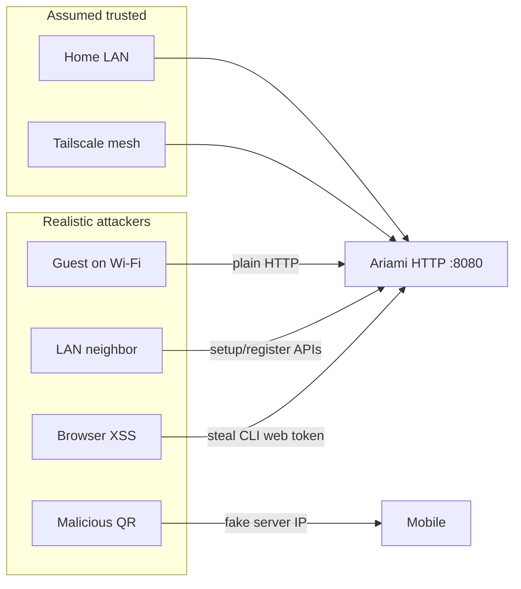
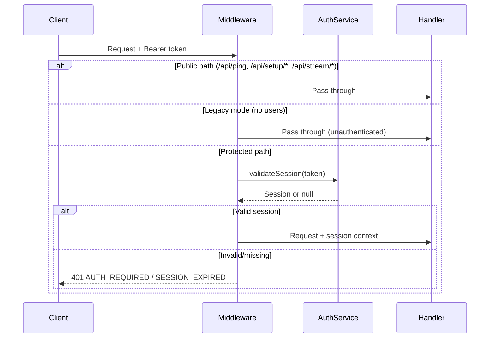
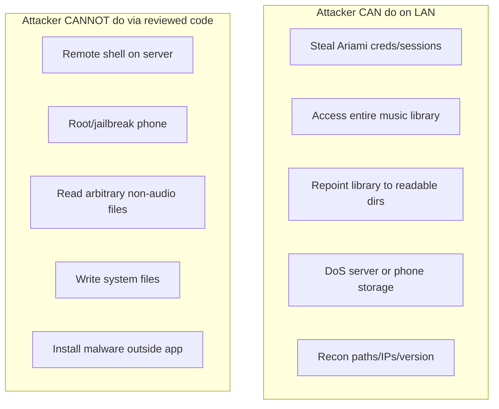

# Ariami Security Audit

**Date:** May 25, 2026  
**Scope:** Full repository (`ariami_core`, `ariami_cli`, `ariami_desktop`, `ariami_mobile`, `sonic`, CI workflows)  
**Type:** Static design review (read-only code audit, no live penetration testing)

---

## Executive Summary

Ariami is a **self-hosted LAN/Tailscale music server** with Flutter clients. The auth foundation is reasonable for a home server: **bcrypt**, **256-bit secure session tokens**, Bearer middleware, short-lived stream/download tickets, and **FlutterSecureStorage** on mobile.

The main risk is not weak cryptography — it is **network exposure with incomplete access control**:

| Area | Assessment |
|------|------------|
| Crypto & token generation | **Good** |
| Auth middleware (when users exist) | **Mostly good** |
| Legacy / first-run modes | **Critical gap** |
| Setup & registration endpoints | **High gap** |
| Transport (TLS) | **Missing** |
| Client token storage (CLI web) | **Weak** |
| Debug instrumentation in prod paths | **High** |

**Bottom line:** On a trusted home LAN with Tailscale and a configured owner account, risk is moderate and aligned with the product's threat model. On any reachable network (guest Wi‑Fi, open LAN, untrusted Tailscale peers), several paths allow **unauthenticated library access, server reconfiguration, or account creation**.

**System compromise:** No straightforward path to remote code execution, root, or arbitrary file write was found. Realistic harm is **application-layer**: steal music and credentials, DoS, misconfigure the server, and read audio files the server process already has permission to read.

---

## Threat Model

Ariami assumes a **trusted network**. Controls break down when that assumption does.



---

## Critical Findings

### C1. Legacy mode = full unauthenticated API

When no users exist, `_legacyMode` is true and auth middleware bypasses protection for almost all routes.

**Location:** `ariami_core/lib/services/server/http_server_parts/middleware_and_metrics_part.dart` (lines 129–132), `lifecycle_and_config_part.dart` (lines 428–435)

**Issue:** When no users exist, `_authMiddleware()` bypasses authentication for all non-public routes. Combined with `_legacyMode = !hasUsers`, the entire library, v2 catalog, stats, album details, and admin-adjacent data become reachable without credentials.

**Impact:** Any client on the network can browse, stream, and download the full music library. Owner setup can be skipped, leaving the server permanently open.

**Remediation:** Require owner account creation before serving library endpoints; fail closed instead of open; show prominent warnings if legacy mode is active; consider binding to localhost until auth is configured.

---

### C2. Plain HTTP on `0.0.0.0`, no TLS

**Location:** `ariami_core/lib/services/server/http_server_parts/lifecycle_and_config_part.dart` (lines 188–237)

**Issue:** Default `bindAddress = '0.0.0.0'`, no TLS/HTTPS anywhere in the server stack. Passwords, session tokens, and stream tickets traverse the network in cleartext.

**Impact:** Credential and token interception on LAN/Wi‑Fi; session hijacking; stream token theft from network captures.

**Remediation:** Add optional TLS (reverse proxy or `SecurityContext`); default bind to `127.0.0.1` for local-only; document Tailscale + HTTPS requirement for remote access.

---

## High Findings

### H1. Setup endpoints remain public after auth is enabled

**Location:** `middleware_and_metrics_part.dart` (lines 114–123), `router_registration_part.dart`, `setup_and_stats_handlers_part.dart`

**Issue:** `/api/setup/*` is always in the public path list, even when `_authRequired=true`. Unauthenticated callers can change the music folder, trigger library scans, mark setup complete, and enumerate folder suggestions (filesystem reconnaissance).

**Impact:** Unauthorized reconfiguration, DoS via rescan, potential exposure of readable server paths.

**Remediation:** Restrict setup routes to legacy/first-run only, or require admin session once users exist.

---

### H2. Open self-registration with no admin approval

**Location:** `auth_and_admin_handlers_part.dart`, `auth_service.dart`

**Issue:** `POST /api/auth/register` is always public with no server-side restriction on who can register. First registered user becomes permanent admin.

**Impact:** Any network attacker can create an account and access the full library (stream, download, v2 sync). Only admin actions remain protected.

**Remediation:** Disable open registration after first user; require admin invite/token; or gate registration to localhost/first-run.

---

### H3. CLI web stores session tokens in SharedPreferences (not secure storage)

**Location:** `ariami_cli/lib/web/services/web_auth_service.dart` (lines 17–18, 102–137)

**Issue:** Session tokens persisted via `SharedPreferences` in browser local storage. Mobile uses `FlutterSecureStorage`.

**Impact:** XSS, browser extensions, or local disk access can steal long-lived session tokens (30-day TTL).

**Remediation:** Use HttpOnly secure cookies for web dashboard sessions, or encrypt tokens; shorten web session TTL; implement Content-Security-Policy on the web UI.

---

### H4. Login rate limiting keyed on client-supplied `deviceId`

**Location:** `auth_service.dart` (lines 107–117, 402–407)

**Issue:** Brute-force protection tracks failures per `deviceId` from the login request body. Attackers can rotate/spoof `deviceId` to bypass the 5-attempt / 15-minute lockout.

**Impact:** Online password guessing against user accounts, especially with 4-character minimum passwords.

**Remediation:** Rate limit by source IP + username; add exponential backoff; consider CAPTCHA after failures.

---

### H5. Permissive CORS policy

**Location:** `middleware_and_metrics_part.dart` (lines 89–94)

**Issue:** `Access-Control-Allow-Origin: *` with `Authorization` allowed.

**Impact:** If a session token is obtained, any origin can make cross-origin authenticated API calls from a victim's browser context.

**Remediation:** Restrict CORS to known dashboard origins; avoid `*` when credentials/tokens are involved.

---

### H6. Debug instrumentation in production code paths

**Location:** `ariami_core/lib/debug/agent_debug_log.dart`, call sites in `library_scanner_isolate.dart`, `duplicate_detector.dart`, `playback_manager_streaming_impl.dart`, `search_screen.dart`

**Issue:** `agentDebugLog` writes to a hardcoded developer path and POSTs to `http://127.0.0.1:7910/ingest/...`.

**Impact:** Unintended data exfiltration to local debug endpoints; hardcoded paths fail on other machines; should not ship in production builds.

**Remediation:** Remove or gate behind debug flags; strip from release builds.

---

### H7. Auth credential files stored as plaintext JSON on disk

**Location:** `user_store.dart`, `session_store.dart`, `desktop_state_service.dart`

**Issue:** `users.json` contains bcrypt hashes; `sessions.json` contains active session tokens. No file-permission hardening in code.

**Impact:** Local attacker or backup exposure yields offline hash cracking or session replay.

**Remediation:** Restrict file permissions (0600); consider encrypting at rest; rotate sessions on server restart option.

---

## Medium Findings

| ID | Issue | Location / Notes | Impact | Remediation |
|----|-------|------------------|--------|-------------|
| M1 | Weak password policy | `auth_service.dart` — min length 4 | Trivially guessable passwords | Enforce ≥12 characters |
| M2 | Long-lived sessions with sliding expiry | `session_store.dart` — 30-day TTL refreshed on every request | Stolen tokens remain valid extended periods | Add absolute max lifetime; session revocation UI |
| M3 | Stream/download tokens in URL query strings | `stream_and_download_handlers_part.dart`, `logRequests()` | Leakage via access logs, browser history, Referer | Use Authorization header; redact from logs |
| M4 | WebSocket broadcasts to unauthenticated connections | `websocket_and_static_part.dart` | Passive info disclosure to unauthenticated listeners | Require auth before broadcast subscription |
| M5 | Error responses leak internal exception details | `middleware_and_metrics_part.dart` (lines 312–318) | Information disclosure (paths, internal state) | Generic errors in production |
| M6 | Music folder path containment uses unsafe prefix check | `stream_and_download_handlers_part.dart` (lines 110–116) | Prefix bypass (`/music` vs `/music_extra`); symlink edge cases | Use `path.isWithin()` or separator-boundary check |
| M7 | Dashboard device identity is client-asserted | `auth_service.dart`, `connection_handlers_part.dart` | Bypasses single-device session policy | Server-issued device credentials |
| M8 | QR pairing has no shared secret | QR encodes server endpoints only | MITM / fake QR risk | Pairing PIN or hostname verification |
| M9 | No global HTTP rate limiting | Only login failures and per-feature limits | Resource exhaustion | Per-IP rate limits on auth, tickets, expensive endpoints |
| M10 | No request body size limits | Handlers using `request.readAsString()` | Memory pressure from large POST bodies | Enforce Content-Length limits in middleware |
| M11 | Stream tickets issued without song existence check | `auth_and_admin_handlers_part.dart` | Memory DoS via ticket flooding | Reject unknown `songId`; cap tickets per session |
| M12 | Information disclosure via public recon endpoints | `/api/server-info`, `/api/tailscale/status`, scan `failedFiles` | Server fingerprinting, filesystem probing | Restrict to authenticated admin or setup phase |
| M13 | Android cleartext traffic allowed | Expected for HTTP server | MITM on mobile | Document; use HTTPS when possible |
| M14 | CI: no Dependabot / dependency scanning | `.github/workflows/` | Supply-chain risk | Add Dependabot; pin third-party downloads |

---

## Low / Informational Findings

| ID | Issue | Notes |
|----|-------|-------|
| L1 | Admin role tied to account creation order | No role promotion/demotion API |
| L2 | Public informational endpoints | `/api/ping`, `/api/server-info`, `/api/tailscale/status` aid discovery |
| L3 | Register does not auto-create session | Minor UX issue |
| L4 | Desktop admin token held in memory only | Low risk for desktop app |
| L5 | Feature flag default inconsistency | `enableApiScopedAuthForCliWeb` model vs loader defaults differ |
| L6 | Android exported media components | Standard for media apps; audit on `audio_service` upgrades |
| L7 | Import/export writes user-chosen JSON paths | User-controlled export; may contain listening history |

**Not observed (positive):**

- No hardcoded secrets in source (good `.gitignore` for `users.json`, `sessions.json`, keystores)
- No classic SSRF — handlers don't fetch user-supplied URLs
- No file upload routes
- Subprocess calls use argv arrays — no shell injection observed
- No eval or dynamic code execution
- SQL uses bound parameters in catalog code

---

## Positive Security Practices

| Practice | Location |
|----------|----------|
| bcrypt password hashing (cost 10) | `auth_service.dart` |
| 256-bit cryptographically secure session tokens | `session_store.dart` |
| Bearer middleware with session validation + context injection | `middleware_and_metrics_part.dart` |
| Admin endpoints gated by `_authorizeAdminRequest()` | `auth_and_admin_handlers_part.dart` |
| Short-lived, song-scoped stream/download tickets | `stream_tracker.dart` |
| Token revocation on logout, kick, password change | auth handlers |
| Single mobile device session policy (dashboard exempt) | `auth_service.dart` |
| Music file path confinement to configured folder | `stream_and_download_handlers_part.dart` |
| Per-user download and artwork rate limiting | limiters + handlers |
| Mobile session tokens in FlutterSecureStorage | `connection_persistence_manager.dart` |
| Last-admin deletion protection | `auth_and_admin_handlers_part.dart` |
| Extensive auth integration tests | `http_server_cli_web_auth_test.dart`, etc. |
| v2 API double-gated via `_handleProtectedV2Request` | `middleware_and_metrics_part.dart` |
| WebSocket auth enforced on `identify` in auth mode | `websocket_and_static_part.dart` |
| Generic auth error messages (no username enumeration on login) | `auth_service.dart` |
| Static file serving with `listDirectories: false` | `websocket_and_static_part.dart` |
| Library scan with `followLinks: false` | `file_scanner.dart` |
| Atomic JSON persistence (temp file + rename) | `user_store.dart`, `session_store.dart` |
| No secrets embedded in QR codes | server-info / QR screens |
| Download fairness via weighted per-user limiter | `http_server_limiters.dart` |

---

## Endpoint Authorization Matrix (Auth-Required Mode)

| Endpoint | Auth Required | Admin Only | Notes |
|----------|--------------|------------|-------|
| `/api/auth/register`, `/api/auth/login` | No | No | Always public |
| `/api/auth/logout`, `/api/me` | Yes | No | |
| `/api/admin/*` | Yes | Yes | `_authorizeAdminRequest` |
| `/api/stream-ticket`, `/api/download-ticket` | Yes | No | Issues tickets |
| `/api/stream/*`, `/api/download/*` | Ticket | No | Public path; ticket checked in handler |
| `/api/v2/*` | Yes | No | `_handleProtectedV2Request` |
| `/api/stats`, `/api/albums/:id` | Yes | No | |
| `/api/setup/*` | **No** | **No** | **Gap: always public** |
| `/api/server-info`, `/api/ping` | No | No | Discovery |
| `/api/ws` | Partial | No | Connect public; identify requires token |
| Legacy mode (no users) | **None** | — | **Full bypass** |

---

## Default Credentials / Bypass Paths

| Bypass | Condition | Severity |
|--------|-----------|----------|
| Full API access | No users registered (legacy mode) | Critical |
| Library stream/download | Legacy mode, no token needed | Critical |
| Server reconfiguration | `/api/setup/*` without auth | High |
| Account creation | `/api/auth/register` always open | High |
| Rate limit evasion | Spoof `deviceId` on login | High |
| Concurrent session policy | Claim dashboard `deviceName` | Medium |
| WS library events | Connect to `/api/ws` without identify | Medium |

**No hardcoded default passwords found** in production code.

---

## SSRF, Path Traversal, File Upload

| Category | Assessment |
|----------|------------|
| **SSRF** | **Not observed.** Handlers do not fetch user-supplied URLs. |
| **Path traversal (media)** | Song IDs are MD5-derived hex, looked up in catalog — not raw filesystem paths. Residual risk: prefix `startsWith` containment check. |
| **Path traversal (static)** | `shelf_static` with `listDirectories: false`. |
| **Symlinks** | Scanner uses `followLinks: false`. Stream path check does not resolve symlinks. |
| **File upload** | **None.** |
| **Deserialization** | JSON via `dart:convert`; catalog SQL uses bound parameters. |

---

## CORS Configuration

```dart
// middleware_and_metrics_part.dart
Map<String, String> _corsHeaders() {
  return {
    'Access-Control-Allow-Origin': '*',
    'Access-Control-Allow-Methods': 'GET, POST, PUT, DELETE, OPTIONS',
    'Access-Control-Allow-Headers': 'Content-Type, Authorization',
  };
}
```

Preflight OPTIONS returns 200 with same headers. `*` allows any origin to read responses when tokens are attached manually.

---

## Rate Limiting

| Mechanism | Scope | Location |
|-----------|-------|----------|
| Login failures | 5 attempts / 15 min / `deviceId` | `auth_service.dart` |
| Download concurrency | Global + per-user fair queue | `http_server_limiters.dart` |
| Artwork resize | Per-user concurrent + queue | `library_and_artwork_handlers_part.dart` |
| Download jobs | Per-user job/item caps | `download_job_service.dart` |
| Stream warmup | Max 3 song IDs per request | `auth_and_admin_handlers_part.dart` |
| V2 pagination | `limit` capped (500/1000) | `v2_handlers.dart` |

**Gap:** No general API or IP-based throttling; no rate limit on registration.

---

## System-Level vs Application-Level Risk

### What a LAN attacker CAN do

| Action | How | System-level? |
|--------|-----|----------------|
| Stream/download music library | Legacy mode, stolen session, open registration | No — app data |
| Steal login password / session | Plain HTTP MITM | No — but full Ariami access |
| Become admin | Register first via open `/api/auth/register` | No — Ariami admin, not OS root |
| Change music folder & rescan | Unauthenticated `/api/setup/*` | **Partially** — see below |
| Burn CPU/RAM/disk | Rescans, transcodes, WebSockets, ticket spam | DoS, not RCE |
| Map the filesystem | Setup suggestions, scan `failedFiles`, `/api/server-info` | Recon only |

### What they CANNOT do (via reviewed code)

- Remote shell on the server
- Root/jailbreak the phone
- Read arbitrary non-audio files via API
- Write system files
- Install malware outside the app sandbox
- Upload and execute a webshell

### Music folder repointing nuance

`POST /api/setup/music-folder` can point the library at **any directory the Ariami process can read** — not just `~/Music`. After a rescan, every audio file under that tree becomes streamable. Still limited to audio extensions (`.mp3`, `.flac`, etc.), not arbitrary secrets — unless sensitive data was stored as audio files.

There is no file upload, no shell built from user input (`Process.run` uses fixed binaries + argv arrays), and no endpoint that writes attacker-chosen paths to disk.

### Mobile-specific risks

| Action | How | Compromises phone/OS? |
|--------|-----|------------------------|
| Phish credentials | Fake QR → rogue server → login screen | No — steals Ariami password |
| Steal session token | HTTP MITM | No — account access |
| Fill storage | Rogue server + huge downloads/cache | Annoying, not root |

Downloads go to the app sandbox (`ApplicationDocumentsDirectory/downloads/...`). No WebView for main UI, no deep-link shell execution.

**Malicious QR** is the main real-world mobile risk: typing credentials into an attacker's server is **credential theft**, not rooting the phone.

### When harm gets worse (environment, not single bugs)

1. CLI server on `0.0.0.0` with no owner account yet — full library exposure
2. Guest Wi‑Fi + HTTP — password and token theft
3. Server running as a user with weak OS password + open registration — attacker gets library + admin
4. Music folder pointed at a huge readable tree — exfiltration of every audio file that user can read

---

## Priority Remediation Roadmap

| Priority | Action |
|----------|--------|
| **P0** | Remove or gate `agentDebugLog` from production builds |
| **P0** | Lock down `/api/setup/*` after setup completes (admin-only or one-time token) |
| **P0** | Disable open registration after first user / require admin invite |
| **P0** | Require owner account before library endpoints; reduce legacy-mode exposure |
| **P1** | Add TLS or document/enforce encrypted overlay (Tailscale-only) |
| **P1** | Strengthen passwords (≥12 chars); rate limit by IP + username |
| **P1** | Move CLI web sessions off SharedPreferences (HttpOnly cookies or encrypted storage) |
| **P1** | Tighten CORS; stop returning raw exception strings to clients |
| **P1** | Restrict file permissions on `sessions.json` / `users.json` (`0600`) |
| **P2** | Redact tokens from logs; prefer Authorization header over query params |
| **P2** | WS auth before broadcast subscription; connection limits |
| **P2** | Symlink-safe path containment; QR pairing verification (PIN/display hostname) |
| **P3** | Dependabot; pin third-party CI downloads; shorten session TTL |

---

## Suggested Manual Verification

1. After owner setup: `curl -X POST http://<server>:8080/api/setup/music-folder -d '{"path":"/tmp"}'` — should return **401** (may return 200 today).
2. After owner exists: `curl -X POST http://<server>:8080/api/auth/register -d '{"username":"attacker","password":"test"}'` — should **fail** (may succeed today).
3. Browser DevTools → Application → Local Storage → look for `cli_web_session_token`.
4. Scan crafted QR with fake server IP — confirm app warns or rejects before login.
5. MITM on LAN while streaming — confirms cleartext exposure.
6. Verify `sessions.json` mode is not world-readable on shared multi-user hosts.

---

## Authentication Flow (Reference)



**Streaming path (auth mode):**

1. Authenticated `POST /api/stream-ticket` → short-lived `streamToken`
2. `GET /api/stream/{songId}?streamToken=...` → validated against ticket + song ID

---

## Packages Audited

- `ariami_core` — HTTP server, auth, library, transcoding
- `ariami_cli` — CLI server runner + web dashboard
- `ariami_desktop` — Desktop app
- `ariami_mobile` — Mobile app
- `sonic` — Rust transcoder FFI
- `.github/workflows/` — CI/CD

**Not in scope:** Live penetration testing, dependency CVE database lookup, mobile app store review, infrastructure outside the repo.

---

## Risk Summary Diagram



---

*Generated from static code audit. Re-run after significant auth or server changes.*
