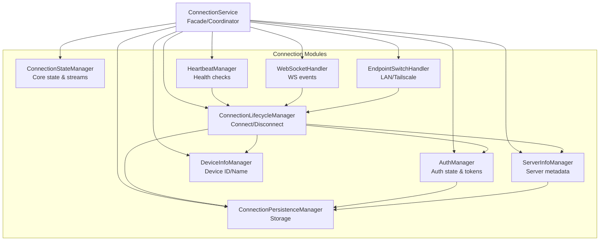

# ConnectionService Modularization Plan

## Overview
Refactor the 1258-line `ConnectionService` into a modular architecture while maintaining **100% backward compatibility**. No functionality should break.

## Current Analysis

### File Statistics
- **Lines of Code**: 1,258
- **Responsibilities**: 10 distinct concerns mixed together
- **Public Methods**: 15+
- **Private Methods**: 30+
- **State Variables**: 25+

### Current Responsibilities (Mixed Together)

1. **Connection State Management** - `_isConnected`, stream controllers, state broadcasting
2. **Authentication** - login, logout, register, session management, secure storage
3. **Server Info Management** - hydration, endpoint resolution, metadata updates
4. **Connection Lifecycle** - connect, disconnect, restore connection
5. **Heartbeat Mechanism** - periodic pings, failure detection, auto-reconnect
6. **WebSocket Handling** - reconnect/disconnect handlers, message processing
7. **Device Info** - device ID generation, device name resolution
8. **Persistence** - SharedPreferences, secure storage for auth tokens
9. **Endpoint Switching** - LAN/Tailscale failover, network route monitoring
10. **Library Sync Coordination** - starting/stopping sync engine

## Proposed Architecture



## Module Breakdown

### 1. ConnectionStateManager
**Purpose**: Central source of truth for connection state

**Responsibilities**:
- Track `_isConnected`, `_isManuallyDisconnected`
- Broadcast state changes via `connectionStateController`
- Broadcast server info changes via `serverInfoController`
- Track restore failure state (`_lastRestoreFailureCode`, etc.)

**Public API**:
```dart
Stream<bool> get connectionStateStream
Stream<ServerInfo?> get serverInfoStream
bool get isConnected
bool get isManuallyDisconnected
String? get lastRestoreFailureCode
void setConnected(bool value)
void setManuallyDisconnected(bool value)
void setServerInfo(ServerInfo? info)
void setRestoreFailure({required String code, required String message, Map<String, dynamic>? details})
void clearRestoreFailure()
```

### 2. AuthManager
**Purpose**: Manage authentication state and secure storage

**Responsibilities**:
- Store/retrieve session token, userId, username
- Secure storage operations
- Session expiry handling
- Auth state broadcasts via `sessionExpiredController`

**Public API**:
```dart
Stream<void> get sessionExpiredStream
String? get sessionToken
String? get userId
String? get username
bool get isAuthenticated
Map<String, String>? get authHeaders
Future<void> loadAuthInfo()
Future<void> setAuthInfo({required String token, required String userId, required String username})
Future<void> clearAuthInfo()
Future<void> handleSessionExpired()
```

### 3. ServerInfoManager
**Purpose**: Manage server configuration and metadata

**Responsibilities**:
- Store current server info
- Hydrate server metadata from API
- Coordinate with EndpointResolver
- Download limits application

**Public API**:
```dart
ServerInfo? get serverInfo
bool get hasServerInfo
Future<ServerInfo> resolvePreferredServerInfo(ServerInfo info)
Future<ServerInfo> hydrateServerInfoMetadata(ApiClient client, ServerInfo info)
void setServerInfo(ServerInfo? info)
```

### 4. ConnectionLifecycleManager
**Purpose**: Handle connection establishment and teardown

**Responsibilities**:
- Connect to server (from QR or ServerInfo)
- Disconnect from server
- Restore previous connection
- Connection info persistence

**Public API**:
```dart
Future<void> connectToServer(ServerInfo serverInfo, {String? sessionToken})
Future<void> connectFromQr(String qrData, {String? sessionToken})
Future<void> disconnect({bool isManual = false})
Future<bool> tryRestoreConnection({String? sessionToken})
Future<void> loadServerInfoFromStorage()
```

### 5. HeartbeatManager
**Purpose**: Maintain connection health via periodic pings

**Responsibilities**:
- Start/stop heartbeat timer
- Send periodic pings
- Track consecutive failures
- Trigger connection loss handling
- Auto-reconnect in auto-offline mode

**Public API**:
```dart
void startHeartbeat()
void stopHeartbeat()
Future<void> sendHeartbeat()
void resetFailureCount()
```

### 6. WebSocketHandler
**Purpose**: Handle WebSocket connection events

**Responsibilities**:
- Handle WebSocket reconnect events
- Handle WebSocket disconnect events
- Process WebSocket messages (sync tokens)
- Send identify messages

**Public API**:
```dart
void onWebSocketReconnect()
void onWebSocketDisconnect()
void onWebSocketMessage(WsMessage message)
Future<void> sendIdentify()
```

### 7. DeviceInfoManager
**Purpose**: Manage device identification

**Responsibilities**:
- Generate/retrieve device ID
- Determine device name
- Persist device ID

**Public API**:
```dart
Future<String> getDeviceId()
Future<String> getDeviceName()
Future<void> saveDeviceId(String deviceId)
```

### 8. ConnectionPersistenceManager
**Purpose**: Handle all persistence operations

**Responsibilities**:
- Save/load connection info (SharedPreferences)
- Save/load auth info (FlutterSecureStorage)
- Save device ID

**Public API**:
```dart
Future<void> saveConnectionInfo(ServerInfo serverInfo, String sessionId)
Future<ServerInfo?> loadServerInfo()
Future<void> saveAuthInfo({String? token, String? userId, String? username})
Future<Map<String, String?>> loadAuthInfo()
Future<void> clearAuthInfo()
Future<void> saveDeviceId(String deviceId)
Future<String?> loadDeviceId()
```

### 9. EndpointSwitchHandler
**Purpose**: Handle network endpoint switching (LAN/Tailscale)

**Responsibilities**:
- Monitor endpoint changes
- Handle endpoint switch requests
- Restore connection after failed switch

**Public API**:
```dart
void configureMonitoring(ServerInfo serverInfo)
void stopMonitoring()
Future<void> handleEndpointSwitch(String newIp)
bool get isSwitchingEndpoint
```

## Refactored ConnectionService

The main `ConnectionService` becomes a **facade** that:
1. Maintains the same public API for backward compatibility
2. Delegates to the specialized managers
3. Coordinates between managers
4. Still handles complex cross-cutting concerns

### Key Changes:
- All private fields become references to manager instances
- Each method delegates to the appropriate manager
- Complex operations (like `_completeAuthConnection`) remain in the facade but use managers

## Testing Strategy

### Unit Tests (for each module)
1. `connection_state_manager_test.dart`
2. `auth_manager_test.dart`
3. `server_info_manager_test.dart`
4. `connection_lifecycle_manager_test.dart`
5. `heartbeat_manager_test.dart`
6. `websocket_handler_test.dart`
7. `device_info_manager_test.dart`
8. `connection_persistence_manager_test.dart`
9. `endpoint_switch_handler_test.dart`

### Integration Tests
1. `connection_service_integration_test.dart` - Verify full workflow

### Mock Dependencies
- SharedPreferences (via shared_preferences package mock)
- FlutterSecureStorage (via flutter_secure_storage mock)
- ApiClient (custom mock)
- WebSocketService (custom mock)
- EndpointResolver (custom mock)

## Implementation Phases

### Phase 1: Foundation
1. Create connection/ folder
2. Create ConnectionStateManager
3. Create AuthManager
4. Create DeviceInfoManager
5. Create ConnectionPersistenceManager

### Phase 2: Core Connection Logic
1. Create ServerInfoManager
2. Create ConnectionLifecycleManager

### Phase 3: Advanced Features
1. Create HeartbeatManager
2. Create WebSocketHandler
3. Create EndpointSwitchHandler

### Phase 4: Integration
1. Refactor ConnectionService to use all managers
2. Ensure backward compatibility

### Phase 5: Testing
1. Write unit tests for all modules
2. Write integration tests
3. Run full test suite

## Backward Compatibility Guarantees

The following must remain unchanged:
- All public method signatures
- All public getter signatures
- All stream types and behavior
- All error handling behavior
- Singleton pattern implementation
- Import paths (will re-export from new location)

## Directory Structure

```
lib/services/api/
├── api_client.dart
├── connection/
│   ├── connection_state_manager.dart
│   ├── auth_manager.dart
│   ├── server_info_manager.dart
│   ├── connection_lifecycle_manager.dart
│   ├── heartbeat_manager.dart
│   ├── websocket_handler.dart
│   ├── device_info_manager.dart
│   ├── connection_persistence_manager.dart
│   └── endpoint_switch_handler.dart
├── connection_service.dart (refactored facade)
├── endpoint_resolver.dart
└── websocket_service.dart
```

## Risk Mitigation

1. **No Breaking Changes**: All existing code using `ConnectionService` must continue to work
2. **Incremental Implementation**: Build managers one at a time, test each thoroughly
3. **Comprehensive Testing**: Unit tests for every manager, integration tests for the facade
4. **Code Review Points**: Each phase should be reviewed before proceeding
5. **Fallback Plan**: Keep original file backed up during development
